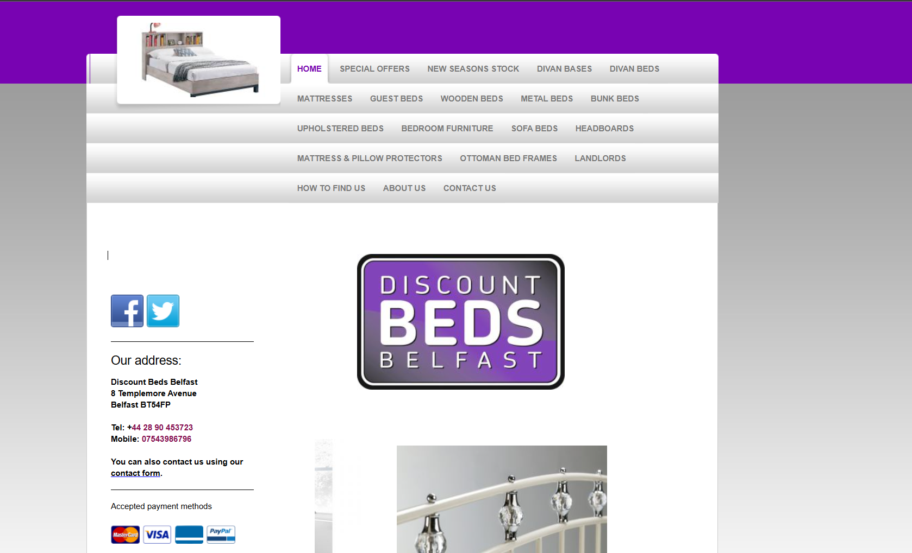

# Project

## Tasked to Do

- Find the top 3 bad-looking websites and choose one for the UI/UX project. The website will be redesign by us and present to everyone in class later on.

## How Did We Do It

 1. Went on Google and searched for "worst website design".
 2. Looked through several examples and picked three.
 3. Chose one that fits best and easiest for redesign.
 4. Show it to Chris and asking fill question about the project

## What Website I Chose

I chose the **[Discount Beds Belfast](https://www.discountbedsbelfast.co.uk/)** website.

Here is an image of the website:  

## Why I Chose This

- It's look super messy even with a simple design.The design look blank and old. It provided too much information in one page.

## Are you working alone or team.Why?

- I work with my team, because it feel better to share work problems with trusted people.

## What hope to get out of the classes?

-
