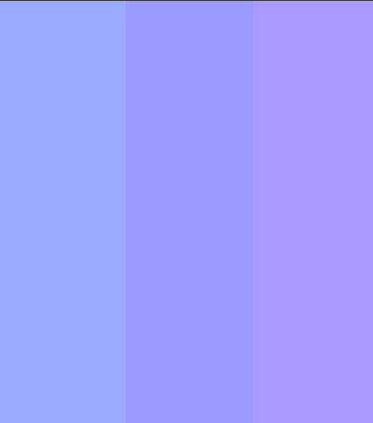

# Week 9 Report

## What I Learned in ACIT 2811 (UX/UI)

---

## Color Theory

### Additive vs Subtractive Color Models

#### Subtractive Color (Physical Media)
- Starts with **white**
- White reflects all colors in the spectrum
- Adding pigment (e.g., markers, paint) **removes/subtracts light**

**Example:**
- Yellow + Blue = Green

---

#### Additive Color (Digital Screens)
- Starts with **black**
- Uses **RGB (Red, Green, Blue)** as primary colors
- Colors are created by **adding light**

**Secondary Colors:**
- Cyan
- Magenta
- Yellow

---

## Color Harmonies & UI Requirements

For high-fidelity wireframes, the design must include:

### Color Scheme
- **Primary Color** → Most frequently used
- **Secondary Color** → Supporting color
- **Highlight Color** → Used sparingly for emphasis

Rules:
- Do NOT include **black or white** as part of the 3-color scheme  
  (but still use them in the design)
- Must follow a valid **color harmony**
- Cannot use:
  - Analogous
  - Monochromatic

---

### Accessibility (IMPORTANT)
- Must meet **WCAG AA contrast standards**
- Use: https://webaim.org/resources/contrastchecker/

- Do NOT rely only on color to show meaning  
  (important for color-blind users)

Use:
- Icons  
- Text labels  
- Visual indicators  

---

### Color & Branding
- Colors should reflect the **purpose and audience**
- Example:
  - Blue → Trust / Professional
  - Red → Urgency / Energy
  - Green → Nature / Growth

---

## Typography

### Font Basics
- **Font-family** = Typeface (e.g., Helvetica, Arial)

---

### Types of Fonts

#### Display Fonts (Headings)
- More expressive
- Used for titles and emphasis

#### Body Fonts
- Simple and readable
- Used for paragraphs and content

---

### Best Practices
- Use **2 fonts only**:
  - 1 for headings
  - 1 for body text

- Choose fonts with a **similar style/feel**
- Common pairing: Serif + Sans-serif

---

### Avoid
- Comic Sans  
- Papyrus  
- Cursive fonts

---

### What me and my team did:

- We use Metrophobic and Playsen Sans for the Typography.
  - **[Metrophobic](https://fonts.google.com/specimen/Metrophobic?categoryFilters=Feeling:%2FExpressive%2FBusiness;Sans+Serif:%2FSans%2FSuperellipse&preview.script=Latn)**
  - **[Playsen Sans](https://fonts.google.com/specimen/Playpen+Sans?categoryFilters=Feeling:%2FExpressive%2FPlayful;Calligraphy:%2FScript%2FHandwritten)**

- We chose these color because it bring a relax and sleepy feeling which is fit our standard.

